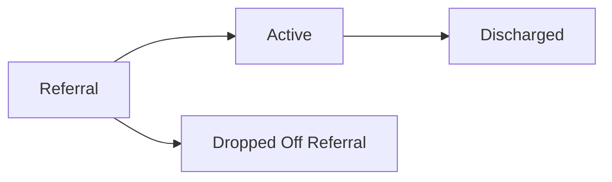

# Patient Status Pipeline - Proposed Simplification

**Implementation brief for the IT / product team**  
**Organization:** EVO Care Group (Link Homecare & Avondale Care Group)  
**Prepared:** June 30, 2026  
**Status:** Working draft for discussion

---

## 1. What We're Changing and Why

The current patient progress bar has five stages:

```text
Pre Intake -> In Progress -> Authorized -> Dropped Off -> Closed
```

In practice, these stages blur together and create ambiguity. For example, **Dropped Off** and **Closed** both mean that a case ended, but for different reasons.

The proposed model collapses the pipeline into **three clear stages**, with sub-statuses only where they add meaning. The goal is a pipeline that intake, scheduling, billing, and other teams can read at a glance, while supporting clean reporting on where and why patients leave.

---

## 2. Old Structure to New Structure

| New Stage | New Sub-Statuses | Replaces / Comes From |
|---|---|---|
| **Referral** | New Referral; In Progress Referral; Dropped Off Referral | Pre Intake, In Progress, and any Dropped Off case that never became Active |
| **Active** | Non-Authorized; Authorized | Authorized |
| **Discharged** | None - uses a discharge reason field | Closed, and any Dropped Off case that was previously Active |

The standalone **In Progress** stage is retired and becomes a sub-status under **Referral**.

The standalone patient-level **Dropped Off** and **Closed** stages are also retired. Where a departing patient lands depends on whether the patient was ever Active.

---

## 3. The Three Stages Defined



### 3.1 Referral

Everything before a patient becomes active with the agency, including intake and authorization work.

**Sub-statuses:**

- New Referral
- In Progress Referral
- Dropped Off Referral

### 3.2 Active

The patient is on service with the agency or has been cleared to start.

**Sub-statuses:**

- Non-Authorized
- Authorized

### 3.3 Discharged

A patient who was previously Active and has now left the agency entirely.

This is a terminal stage.

**Sub-statuses:** None  
**Required outcome fields:**

- Discharge reason
- Discharge date

---

## 4. Rules That Govern the Flow

These rules are intended to be encoded strictly so the data remains clean.

### Rule 1 - Discharged Is Reachable Only From Active

A patient must have been Active at some point before being moved to Discharged.

If the person never became Active, they cannot be classified as Discharged.

### Rule 2 - A Pre-Active Exit Becomes Dropped Off Referral

A patient who leaves before becoming Active moves to:

```text
Referral / Dropped Off Referral
```

This replaces the old patient-level **Dropped Off** status.

### Rule 3 - Discharge Is a Whole-Patient Action

Moving a patient to Discharged ends the patient's relationship with the agency entirely.

Discharge must not be used only to end one individual service.

### Rule 4 - Service Lines Are Dropped Individually

Each service line, such as Long Term or Custodial, has its own per-service **Drop** control.

Dropping one service line does not automatically change the patient's overall pipeline stage. The patient remains Active as long as at least one service continues.

### Rule 5 - Service-Line Statuses Move Independently

A patient may have one service line still in progress while another is already authorized.

The patient-level pipeline reflects the patient's overall relationship with the agency. The individual service cards reflect the status of each line of business.

### Plain-Language Summary

| Situation | Correct Handling |
|---|---|
| The patient left before services ever started | Dropped Off Referral |
| The agency was caring for the patient and the relationship ended | Discharged |
| One service ended but another continues | Drop only that service line |

---

## 5. Discharge Reason Field

Because Discharged has no sub-statuses, the reason the patient left should be captured in a dedicated structured field.

A controlled dropdown is recommended instead of unrestricted free text so the organization can report reliably on attrition causes.

### Suggested Starting Values for the New York Medicaid Population

- Permanent nursing home / institutional placement
- Hospitalized - long-term
- Deceased
- Moved out of service area
- Transferred to another agency
- Lost Medicaid / MLTC eligibility
- Patient or family declined services
- Goals met / no longer needs care

### IT Decision

Should the dropdown include:

```text
Other -> Specify
```

**Recommendation:** Yes, but only as a last-resort option. A conditional free-text field may appear when Other is selected, while the structured options remain the preferred reporting values.

---

## 6. Full Record Examples

The recommended patient record shows only the current stage's active sub-status as a chip, rather than displaying every sub-status under every stage.

**Suggested visual behavior:**

- Purple: active or in-flight stage
- Gray: terminal or ended state
- Completed prior stages: marked as completed

---

### State A - Referral / In Progress Referral

**Patient:** John D.  
**Record label:** Patient - referral in progress

#### Service Lines

| Service Line | Status | Authorization | Updated | Action |
|---|---|---|---|---|
| Long Term | In Progress | Authorization pending | June 28, 2026 | Drop |
| Add Service | - | - | - | Add service |

#### Pipeline

```text
Referral [In Progress Referral] -> Active -> Discharged
```

#### Record Fields

| Field | Value |
|---|---|
| First Name | John |
| Last Name | D. |
| MLTC | CPHL |
| LHCSA Coordinator | Lis Sukram (ext. 758) |
| Primary Language | English |
| Patient Status Date | June 28, 2026 |
| Medicaid Anticipated Start of Care | August 1, 2026 |

**Interpretation:** No service is authorized yet. The only service line is still In Progress. If the patient leaves at this point, the record moves to **Referral / Dropped Off Referral**.

---

### State B - Referral / Dropped Off Referral

**Patient:** John D.  
**Record label:** Patient - dropped off during referral

#### Service Lines

| Service Line | Status | Authorization | Updated |
|---|---|---|---|
| Long Term | Dropped | Never authorized | July 2, 2026 |

#### Pipeline

```text
Referral [Dropped Off Referral] -> Active -> Discharged
```

#### Drop Details

| Field | Value |
|---|---|
| Drop Date | July 2, 2026 |
| Drop Reason | Could not reach patient |

#### Record Fields

| Field | Value |
|---|---|
| First Name | John |
| Last Name | D. |
| MLTC | CPHL |
| Patient Status Date | July 2, 2026 |

**Interpretation:** The patient left before any service was authorized and never became Active. The case ends inside the Referral stage and does not reach Active or Discharged.

---

### State C - Active / Authorized

**Patient:** John D.  
**Record label:** Patient - active on service

#### Service Lines

| Service Line | Status | Authorization Period | Updated | Action |
|---|---|---|---|---|
| Long Term | In Progress | April 1, 2025 - February 25, 2026 | June 22, 2026 | Drop |
| Custodial | Authorized | June 25 - August 20, 2026 | June 26, 2026 | Drop |

#### Pipeline

```text
Referral [Completed] -> Active [Authorized] -> Discharged
```

#### Record Fields

| Field | Value |
|---|---|
| First Name | John |
| Last Name | D. |
| MLTC | CPHL |
| LHCSA Coordinator | Lis Sukram (ext. 758) |
| Mobile | 917-417-5812 |
| Start of Care Date | December 1, 2017 |
| Medicaid Patient Status Date | June 30, 2026 |

**Interpretation:** Two service lines are moving independently. One remains In Progress while the other is Authorized. The overall patient status is **Active / Authorized**.

---

### State D - Discharged

**Patient:** John D.  
**Record label:** Patient - discharged

#### Pipeline

```text
Referral [Completed] -> Active [Completed] -> Discharged
```

#### Discharge Details

| Field | Value |
|---|---|
| Discharge Date | June 30, 2026 |
| Discharge Reason | Permanent nursing home placement |

#### Record Fields

| Field | Value |
|---|---|
| First Name | John |
| Last Name | D. |
| MLTC | CPHL |
| Start of Care Date | December 1, 2017 |

**Interpretation:** The patient has fully exited the agency. The service cards are no longer shown, and the reason for leaving is preserved in one structured discharge field instead of a separate status.

---

## 7. Proposed Decision Summary for IT / Product

| Decision Area | Proposed Rule |
|---|---|
| Top-level patient stages | Referral, Active, Discharged |
| Referral sub-statuses | New Referral, In Progress Referral, Dropped Off Referral |
| Active sub-statuses | Non-Authorized, Authorized |
| Discharged sub-statuses | None |
| Pre-active departure | Dropped Off Referral |
| Departure after Active | Discharged |
| Ending one service line | Drop only that service line |
| Ending the entire agency relationship | Discharge the patient |
| Discharge reason | Required controlled dropdown |
| Other discharge reason | Allow Other with conditional specification field |
| Service-line movement | Independent of the patient-level stage |

---

## 8. Status of This Document

This document is a **working draft for discussion** and should not be treated as final implementation approval until operations, leadership, and IT confirm the definitions, transition rules, data-migration treatment, and reporting effects.
