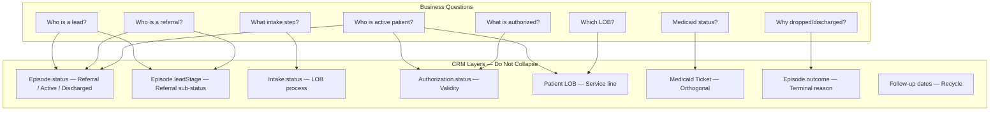

# Link Homecare CRM Status Architecture & Execution Workspace

**Project:** EVO CRM Status Label Overhaul — NY Operations  
**Platform:** Nexus CRM at [crm.linkhomecare.com](https://crm.linkhomecare.com/)  
**Owner (Framework):** Keren  
**Operational truth:** Joel  
**Implementation:** Avi  
**Last updated:** July 6, 2026  
**Status:** Phase 0 — Workshop pipeline agreed; glossary draft; CRM build on hold until labels signed

---

## 1. Executive Context

Link Homecare is rebuilding its CRM operating model so leadership, intake, operations, sales, and growth can answer ten business questions from one trusted data layer — not from conflicting Salesforce-era labels.


| Question                                                       | Why it matters                              |
| -------------------------------------------------------------- | ------------------------------------------- |
| Who is only a lead?                                            | Sales prioritization and SLA accountability |
| Who is a referral being worked?                                | Intake funnel visibility                    |
| Who is truly an active patient?                                | Census, staffing, revenue                   |
| Who is authorized but not active?                              | Pipeline vs census separation               |
| Who dropped before becoming active?                            | Funnel leakage and source quality           |
| Who was active and then discharged?                            | Retention and re-engagement                 |
| Which line of business is involved?                            | Capacity and qualification routing          |
| Which authorizations are valid, expired, stale, or irrelevant? | Ops risk and billing exposure               |
| Which dashboards can be trusted?                               | Leadership decision quality                 |
| Where are referrals leaking?                                   | Growth ROI and process fixes                |


**Known:** The CRM uses a unified person record (Episode in Nexus) that follows someone from first contact through referral, intake, authorization, active service, discharge, or drop-off. Discovery confirmed ~1,960 dashboard "authorized" vs ~1,200–1,300 true active census. CDPAP sunset (April 1, 2025) left a stale authorized cohort. Authorization does not equal active service.

**Assumption:** NY is canonical; Florida adapts after NY is stable.

**Non-negotiable:** Definitions drive dashboards — not the reverse. No Phase 2+ implementation until Status Framework v1 is signed.

---


## 2. Core Problem

The CRM inherited Salesforce-era labels and workarounds that no longer reflect operational reality. One person can simultaneously appear as lead, referral, patient, authorized, dropped, closed, or discharged depending on which field or view is used.


| Pain category               | Manifestation                                                   | Business impact                                      |
| --------------------------- | --------------------------------------------------------------- | ---------------------------------------------------- |
| **Status inflation**        | ~1,960 "authorized" vs ~1,200–1,300 true census                 | Leadership overstates pipeline and census            |
| **Layer collapse**          | Authorization treated as patient status                         | Ops cannot distinguish approved vs actively serviced |
| **Legacy labels**           | Pre-Intake, Closed, Converted still active                      | Teams use different mental models                    |
| **Multi-intake conflict**   | Dropped custodial + in-progress LTC on one record               | Multiple status boxes; manual investigation required |
| **Orthogonal tracks**       | Medicaid tickets parallel to lifecycle                          | Intake blocked but record looks "in progress"        |
| **Stale cohorts**           | CDPAP, Girling/third-party, expired auth                        | Dashboards count non-patients as patients            |
| **Dashboard-first culture** | Reports built on dirty picklists                                | Decisions made on false positives                    |
| **Production bug**          | Auth end date updated but LOB timeline stays expired (Ntelekos) | Active patients show as expired                      |


**Root cause:** One field (or one label) is being asked to answer multiple business questions — lead capture, referral work, intake progress, authorization validity, service activity, and terminal outcomes.

---


## 3. Working Goal

Produce an implementation-ready status architecture that:

1. Separates lifecycle, referral funnel, intake process, authorization validity, LOB service lines, Medicaid tickets, and terminal reasons into distinct layers.
2. Collapses the user-facing master lifecycle to **Lead → Qualifying → Referral in Progress → Active → Discharged**, with **Dropped Off** anytime before Active (workshop agreed Jul 2026). Short-term care runs parallel until authorized.
3. Defines **true active census** as Active + valid authorization + confirmed start of care (SOC).
4. Enables data remediation, validation rules, dashboard rebuild, and eventual growth-system integration (LeadTrap/Ava, Meta, SEO, referral campaigns).
5. Protects operational continuity via phased rollout, manual review queues, and legacy field retention during migration.

**Recommended decision (pending sign-off):** Episode is the master lifecycle object. Patient LOB fields are service-line layer. Intake is subprocess only.

---


## 4. Current Status Confusion


### 4.1 Nexus production picklists (confirmed)


| Object        | Field                       | Current values                                                   |
| ------------- | --------------------------- | ---------------------------------------------------------------- |
| Episode       | `status` (EpisodeStatus)    | New · Lead · Active · Converted · On Hold · Dropped · Discharged |
| Episode       | `leadStage` (LeadStatus)    | — None — · New · In Progress · Dropped Off · Converted           |
| Episode       | `outcome` (ReferralOutcome) | Picklist exists — **values not yet exported**                    |
| Patient       | Legacy picklists            | pre-intake, closed, person-level authorized, in-progress         |
| Authorization | `baseStatus`                | **Free-text STRING** (data integrity risk)                       |
| Intake        | 130 fields, 24 picklists    | Subprocess — not master status                                   |


### 4.2 What teams see today vs what is true


| Screen signal                            | Often means      | Actually may mean                                      |
| ---------------------------------------- | ---------------- | ------------------------------------------------------ |
| "Authorized" on dashboard                | Active patient   | Approved auth, no SOC, dropped intake, or expired auth |
| "Patient" tag + "Lead" tag               | Conflicting      | Same record at different layers                        |
| Lead Status "In Progress" (all 56 leads) | Working referral | No funnel granularity                                  |
| "Pre-Intake"                             | Waiting          | NIA fail, vacation, docs — no standard hold reason     |
| "Closed"                                 | Done             | Could be drop or discharge — undefined                 |
| "Converted"                              | Success          | Legacy Salesforce — should be In Progress Referral     |
| LOB timeline "Expired"                   | Patient inactive | Auth updated but UI not recalculated                   |


### 4.3 Phase 1 — What We Know / Don't Know / Must Decide


| Category                 | Items                                                                                                                                                                                                                                        |
| ------------------------ | -------------------------------------------------------------------------------------------------------------------------------------------------------------------------------------------------------------------------------------------- |
| **What we know**         | Episode-centric model; **workshop pipeline** Lead→Qualifying→Referral in Progress→Active→Discharged; census gap; CDPAP; short-term parallel icon; NIA fail→drop; glossary draft in `crm/glossary/` |
| **What we don't know**   | ReferralOutcome picklist values; NIA reapply wait (180d vs 6mo); Active threshold (SOC vs cleared-to-start); LOB eligibility checklists final |
| **What must be decided** | Framework v1 sign-off; flowcharts; Avi tech review; ~10 drop reasons; CRM one-pass plan after labels final |


---


## 5. Proposed Lifecycle Model


### 5.1 Master lifecycle (Episode — user-facing)

**Workshop agreed (Jul 2026):**

```
Lead → Qualifying → Referral in Progress → Active → Discharged
         │                    │
         └──── Dropped Off ───┘ (anytime before Active)
```

Short-term care: parallel track with **icon** until authorized → then Active in main pipeline.

**Nexus mapping:**

| Workshop stage | Episode.status | Episode.leadStage (proposed) |
| -------------- | -------------- | ---------------------------- |
| Lead | REFERRAL | Lead |
| Qualifying | REFERRAL | Qualifying |
| Referral in Progress | REFERRAL | Referral in Progress |
| Active | ACTIVE | (hidden / n/a) |
| Discharged | DISCHARGED | (hidden / n/a) |
| Dropped Off | REFERRAL (terminal) | Dropped Off + outcome |

**Leadership rollup (optional):** Pre-active stages → "Referral"; Active; Discharged.

### 5.1a Previous 3-stage draft (superseded for enrollment UI)

```
Referral ──────────────────► Active ──────────────────► Discharged
```

Retain for census reporting rollup only. See `crm/glossary/status-terminology-v1.md`.

### 5.2 Internal pipeline stages (computed / ops detail)

For intake teams and automations, the person-centric computation model (`crm/schema/lifecycle.ts`) remains useful as a **sub-layer** beneath Episode Active:


| Internal stage         | Maps to Episode                            | Meaning                               |
| ---------------------- | ------------------------------------------ | ------------------------------------- |
| INTAKE_IN_PROGRESS     | Referral (In Progress) or Active (pre-SOC) | Intake work open on gold LOB          |
| ON_HOLD                | Referral (In Progress) + hold badge        | Pipeline paused — replaces Pre-Intake |
| AUTHORIZED_PENDING_SOC | Active (Authorized)                        | Valid auth, no confirmed SOC          |
| PATIENT_ACTIVE         | Active (Authorized or Non-Authorized)      | Confirmed SOC                         |


### 5.3 Terminology anchors (Joel's model — recommended)


| Term                 | Definition                                                              |
| -------------------- | ----------------------------------------------------------------------- |
| **Lead**             | Raw contact; no meaningful outreach or not yet qualified                |
| **Referral**         | Expressed interest; being worked toward care; not yet an active patient |
| **Patient (Active)** | Link is actively responsible for service                                |
| **Dropped Off**      | Never became an active patient                                          |
| **Discharged**       | Was an active patient; service ended                                    |


---


## 6. Glossary Draft

*Legend: **Known** = from discovery; **Assumption** = recommended pending sign-off; **Needs confirmation** = Phase 0 workshop*


| Term                       | Plain-English meaning                   | Who uses it      | CRM meaning                                                                         | Should NOT mean      | Required fields                             | Related statuses                         | Open questions                                          |
| -------------------------- | --------------------------------------- | ---------------- | ----------------------------------------------------------------------------------- | -------------------- | ------------------------------------------- | ---------------------------------------- | ------------------------------------------------------- |
| **Lead**                   | Someone captured but not yet a referral | Sales, growth    | Pre-referral contact on Episode or Lead object                                      | Patient              | Source, created date, contact info, owner   | → Referral                               | Separate Lead object vs Episode? **Needs confirmation** |
| **New Lead**               | No outreach attempted                   | Sales            | Lead — New / Referral — New Referral                                                | In progress          | Created date, source                        | Lead Contacting, New Referral            | Same as New Referral in Nexus? **Assumption:** merge    |
| **In Progress Lead**       | Outreach started, not converted         | Sales            | Lead — Contacting                                                                   | Authorized, Active   | Last contact date, next follow-up           | Converted → Referral                     | Retire "Converted" label **Recommended**                |
| **Converted Lead**         | Legacy Salesforce                       | —                | **Deprecated** → In Progress Referral                                               | Success terminal     | —                                           | In Progress Referral                     | Retire value **Recommended decision**                   |
| **Referral**               | Being worked toward care                | Intake, sales    | Episode.status = Referral                                                           | Active patient       | LOB interest, owner, intake opened date     | New / In Progress / Dropped Off Referral | —                                                       |
| **New Referral**           | Referral received, minimal work         | Sales, intake    | leadStage = New                                                                     | Active               | Source, created date, contact info          | In Progress Referral                     | —                                                       |
| **In Progress Referral**   | Active intake/referral work             | Intake, sales    | leadStage = In Progress                                                             | Patient Active       | Contact made date, LOB, next follow-up      | Dropped Off, Active                      | Hold badge when ON_HOLD **Assumption**                  |
| **Dropped Off Referral**   | Never became active patient             | Sales, intake    | leadStage = Dropped Off + outcome                                                   | Discharged           | Drop date, outcome, owner                   | Terminal (referral)                      | Reactivation rules **Needs confirmation**               |
| **Patient**                | Link actively servicing                 | Ops, leadership  | Episode.status = Active (with SOC)                                                  | Authorized alone     | SOC date, LOB, coordinator                  | Discharged                               | Census = SOC + valid auth **Recommended**               |
| **Active**                 | Currently receiving Link service        | Ops, leadership  | Episode.status = Active                                                             | Referral in progress | SOC, active LOB, coordinator                | Discharged                               | SOC vs cleared-to-start **Needs confirmation**          |
| **Authorized**             | Payer approved specific service         | Intake, ops      | **Sub-status of Active** OR pre-SOC pipeline state — never top-level Episode status | Active patient       | Auth ID, payer, hours, dates, LOB           | Non-Authorized, Expired                  | **Known:** not census                                   |
| **Non-Authorized**         | Active but missing/expired auth         | Ops              | Active sub-status chip                                                              | Dropped              | Risk flag, follow-up owner                  | Authorized (after remediation)           | Grace period? **Needs confirmation**                    |
| **Expired Authorization**  | Auth end date passed                    | Ops, billing     | authorization_status = AUTH_EXPIRED                                                 | Automatic discharge  | End date, renewal status                    | AUTH_APPROVED (renewed)                  | Still receiving care edge case **See §9**               |
| **Intake**                 | LOB-specific enrollment process         | Intake           | Intake object subprocess                                                            | Master lifecycle     | LOB, intake status, opened date             | Authorization, SOC                       | 130 fields — deprecate list TBD                         |
| **Authorization**          | Payer approval record                   | Intake, ops      | Authorization object                                                                | Person status        | Status, payer, dates, hours, LOB            | Intake link                              | baseStatus STRING → picklist **Known risk**             |
| **Start of Care (SOC)**    | Confirmed first service visit           | Ops              | `start_of_care_date` on intake/LOB                                                  | Anticipated date     | Confirmed date, LOB                         | Active patient                           | Source: EVV vs manual **Needs confirmation**            |
| **Anticipated SOC**        | Planned start before confirmation       | Intake           | `anticipated_soc_date`                                                              | Actual SOC           | Date, LOB                                   | SOC confirmed                            | Stale SLA: 7 days **Assumption**                        |
| **Discharged**             | Was active; service ended               | Ops, leadership  | Episode.status = Discharged                                                         | Dropped Off          | Discharge date, outcome, final service date | Terminal                                 | —                                                       |
| **Dropped Off**            | Never became active patient             | Sales, intake    | Referral terminal (Dropped Off Referral)                                            | Discharged           | Drop date, outcome                          | —                                        | —                                                       |
| **Closed**                 | Legacy undefined                        | —                | **Deprecated** — split to Dropped Off or Discharged                                 | Any precise meaning  | —                                           | Manual review                            | Eliminate **Recommended decision**                      |
| **Pre-Intake**             | Salesforce workaround                   | Legacy users     | **Retire** → ON_HOLD + hold_reason                                                  | Normal status        | hold_reason, hold_until_date                | In Progress Referral                     | Audit count Phase 1 **Known**                           |
| **Voided**                 | Intake opened in error                  | Intake           | intake_status = INTAKE_VOIDED                                                       | Dropped Off (person) | void_reason, voided_by, voided_at           | New intake                               | vs dropped intake **Needs confirmation**                |
| **Deferred**               | Paused eligibility/application          | Medicaid team    | Medicaid ticket status                                                              | Dropped Off          | defer_reason, review date                   | In Progress                              | Joel to define **Needs confirmation**                   |
| **Medicaid Ticket**        | Medicaid application track              | Intake, Medicaid | Orthogonal object                                                                   | Lifecycle stage      | Ticket status, dates                        | —                                        | Does not block Episode display **Assumption**           |
| **Line of Business (LOB)** | Service type track                      | All              | Per-intake / Patient LOB fields                                                     | Master status alone  | LOB picklist                                | Intake, Authorization                    | Primary LOB rule **Needs confirmation**                 |
| **Long-Term Care**         | Gold LOB — MLTC path                    | Intake, ops      | LONG_TERM_CARE                                                                      | Short-term           | NIA status, auth                            | Active                                   | NIA required **Known**                                  |
| **Short-Term Care**        | Temporary skilled/custodial             | Ops              | SHORT_TERM_CUSTODIAL                                                                | Census (usually)     | Referral partner if outsourced              | Dropped / third-party                    | Lead loss default **Recommended**                       |
| **Skilled Care**           | Clinical short-term                     | Ops              | Often outsourced (Girling)                                                          | Link active patient  | Servicing agency                            | THIRD_PARTY_REFERRAL                     | Not Link census **Known**                               |
| **Custodial Care**         | Gold LOB                                | Intake           | CUSTODIAL_CARE                                                                      | —                    | Auth, SOC                                   | Active                                   | —                                                       |
| **Private Pay**            | Gold LOB                                | Intake           | PRIVATE_PAY                                                                         | —                    | Payer, auth                                 | Active                                   | —                                                       |
| **NHTD**                   | Nursing Home Transition/Diversion       | Intake           | NHTD gold LOB                                                                       | —                    | Program-specific checklist                  | Active                                   | Checklist TBD **Phase 0**                               |
| **OPWDD**                  | Disability services                     | Intake           | OPWDD gold LOB                                                                      | —                    | Program-specific checklist                  | Active                                   | Checklist TBD **Phase 0**                               |
| **CDPAP**                  | Deprecated LOB                          | Legacy           | CDPAP — sunset 2025-04-01                                                           | Active after sunset  | Remediation batch                           | Discharged or Dropped Off                | Discharge vs drop **Decision 5**                        |


---


## 7. Status Architecture Draft


### 7.1 Layer 1 — Master lifecycle (Episode.status)


| Status         | Definition                                          | Entry condition                         | Exit condition                                  | Required fields                             | Allowed next                             | Invalid transitions                   | Dashboard impact                                | Owner          |
| -------------- | --------------------------------------------------- | --------------------------------------- | ----------------------------------------------- | ------------------------------------------- | ---------------------------------------- | ------------------------------------- | ----------------------------------------------- | -------------- |
| **REFERRAL**   | Person being worked toward care; not active patient | Lead converted or new referral captured | SOC confirmed → ACTIVE; or Dropped Off Referral | Patient link, owner, source                 | ACTIVE, DISCHARGED (rare), DROPPED (sub) | ACTIVE without SOC (if SOC required)  | Referral funnel, new/in-progress/dropped counts | Sales + Intake |
| **ACTIVE**     | Link responsible for service                        | Confirmed SOC on at least one gold LOB  | All service ended → DISCHARGED                  | SOC date, primary LOB, coordinator          | DISCHARGED                               | → REFERRAL without discharge workflow | **True census** (with auth filter)              | Operations     |
| **DISCHARGED** | Was active; service ended                           | Last active LOB discharged              | New Episode for return referral                 | discharge_date, outcome, final_service_date | New Episode (Referral)                   | → ACTIVE without new Episode          | Discharge reporting, churn                      | Operations     |


### 7.2 Layer 2 — Referral sub-status (Episode.leadStage)


|                          | Sub-status                  | Definition               | Entry                        | Exit                             | Required fields                   | Next statuses | Invalid                   | Dashboard      | Owner |
| ------------------------ | --------------------------- | ------------------------ | ---------------------------- | -------------------------------- | --------------------------------- | ------------- | ------------------------- | -------------- | ----- |
| **New Referral**         | Received, not yet worked    | Referral created         | Contact made / intake opened | Source, created date             | In Progress Referral, Dropped Off | —             | New referrals             | Sales          |       |
| **In Progress Referral** | Active referral/intake work | Contact or intake opened | SOC or drop                  | LOB, next follow-up, intake date | Dropped Off, (→ Active)           | —             | Pipeline, stuck referrals | Intake         |       |
| **Dropped Off Referral** | Never became active         | Drop decision            | Reactivation = new Episode   | outcome, dropped_at, owner       | New Referral (new Episode)        | → Active      | Drop reasons by source    | Sales + Intake |       |


*UI rule:* Show `leadStage` only when Episode.status = Referral.

### 7.3 Layer 3 — Intake status (Intake object)


| Status             | Definition             | Entry                | Exit               | Required fields         | Next                         | Invalid             | Dashboard              | Owner  |
| ------------------ | ---------------------- | -------------------- | ------------------ | ----------------------- | ---------------------------- | ------------------- | ---------------------- | ------ |
| INTAKE_NEW         | Intake opened          | Referral qualified   | Work begins        | LOB, opened_at          | IN_PROGRESS                  | ACTIVE without auth | New intakes by LOB     | Intake |
| INTAKE_IN_PROGRESS | Docs, NIA, assessments | Work started         | Auth or hold       | next_action_date        | ON_HOLD, AUTHORIZED, DROPPED | —                   | Pending NIA, docs      | Intake |
| INTAKE_ON_HOLD     | Paused                 | Hold triggered       | Hold lifted        | hold_reason, hold_until | IN_PROGRESS, DROPPED         | —                   | On-hold queue          | Intake |
| INTAKE_AUTHORIZED  | Auth linked, pre-SOC   | AUTH_APPROVED        | SOC confirmed      | authorization_id        | ACTIVE, DROPPED              | Without valid auth  | Auth pending SOC       | Intake |
| INTAKE_ACTIVE      | Service started        | SOC confirmed        | Discharge/drop LOB | start_of_care_date      | DROPPED, VOIDED              | —                   | Active by LOB          | Ops    |
| INTAKE_VOIDED      | Opened in error        | Void action          | —                  | void_reason             | —                            | —                   | Exclude from funnel    | Intake |
| INTAKE_DROPPED     | LOB attempt ended      | Drop at intake level | —                  | drop_reason             | —                            | —                   | LOB drop ≠ person drop | Intake |


### 7.4 Layer 4 — Authorization validity


| Status        | Definition          | Entry            | Exit            | Required fields          | Next               | Invalid | Dashboard           | Owner  |
| ------------- | ------------------- | ---------------- | --------------- | ------------------------ | ------------------ | ------- | ------------------- | ------ |
| AUTH_PENDING  | Submitted, awaiting | Request sent     | Approved/denied | payer, LOB, request date | APPROVED, DENIED   | —       | Pending auth queue  | Intake |
| AUTH_APPROVED | Valid approval      | Payer approval   | Expiry or void  | start/end dates, hours   | EXPIRED, VOIDED    | —       | Authorized pipeline | Intake |
| AUTH_DENIED   | Not approved        | Denial received  | —               | denial_reason            | —                  | —       | Drop funnel         | Intake |
| AUTH_EXPIRED  | Past end date       | end_date < today | Renewal         | end_date                 | APPROVED (renewed) | —       | Expiring auth risk  | Ops    |
| AUTH_VOIDED   | Cancelled           | Void action      | —               | void_reason              | —                  | —       | Exclude             | Ops    |


*Automation:* On Authorization save → recalc Active sub-status + LOB timeline (Ntelekos fix).

### 7.5 Layer 5 — LOB / service-line status (Patient per-LOB)


| Status         | Definition                 | Entry         | Exit          | Required fields  | Notes                                           |
| -------------- | -------------------------- | ------------- | ------------- | ---------------- | ----------------------------------------------- |
| LOB_PENDING    | LOB identified, not active | Intake opened | Auth/SOC      | LOB, intake_id   | Multiple LOBs per patient                       |
| LOB_ACTIVE     | Service running on LOB     | SOC on LOB    | Discharge LOB | SOC, coordinator | Primary LOB drives Episode                      |
| LOB_DROPPED    | LOB attempt failed         | Drop at LOB   | —             | drop_reason      | Does not discharge patient if other LOB active  |
| LOB_DISCHARGED | LOB service ended          | Discharge     | —             | discharge_date   | Confirm if last active LOB → Episode DISCHARGED |


**Gold LOBs:** LTC, NHTD, OPWDD, Private Pay, Custodial Care.  
**Short-term only:** Lead loss; cap at Referral unless gold LOB also open.

### 7.6 Layer 6 — Medicaid ticket (orthogonal)


| Status               | Definition            | Entry       | Exit   | Required fields           | Notes                      |
| -------------------- | --------------------- | ----------- | ------ | ------------------------- | -------------------------- |
| MEDICAID_NEW         | Ticket opened         | App started | —      | opened_at                 | Does not change Episode    |
| MEDICAID_IN_PROGRESS | Working application   | —           | —      | owner                     | —                          |
| MEDICAID_APPROVED    | Eligibility confirmed | Approval    | CLOSED | approval_date             | —                          |
| MEDICAID_DEFERRED    | Paused                | Deferral    | Review | defer_reason, review_date | SLA 30 days **Assumption** |
| MEDICAID_CLOSED      | Ticket complete       | —           | —      | close_reason              | —                          |


### 7.7 Layer 7 — Drop / discharge reason (Episode.outcome)

Consolidate into **ReferralOutcome** picklist (export and sign off in Phase 0). Groupings:

- **Referral drop:** NIA Failed, No Follow-Up, Competitor, Payer Denied, Short-Term Only, Third-Party Referral, Doc Incomplete, CDPAP Sunset, Other
- **Discharge:** Goals Met, Moved to Facility, Deceased, Voluntary Exit, Payer Change, Service No Longer Needed, Other


### 7.8 Layer 8 — Follow-up / recycle


| State              | Definition                      | Required fields                 | Trigger                 |
| ------------------ | ------------------------------- | ------------------------------- | ----------------------- |
| Follow-up due      | Next action scheduled           | next_follow_up_date, owner      | SLA breach              |
| Re-engage eligible | Hold expired (e.g. NIA 6-month) | hold_until_date passed          | Automation creates task |
| Recycled referral  | Returning former patient        | new Episode, prior Episode link | Manual or campaign      |


---


## 8. Layer Separation Model




**Rule:** No single picklist answers more than one row in the questions box.

---


## 9. Edge Case Decision Log


| #   | Scenario                                | Current confusion             | Recommended handling                                                                                         | Layer(s)           | Required fields             | Dashboard                               | Decision owner | Final decision  | Implementation note                      |
| --- | --------------------------------------- | ----------------------------- | ------------------------------------------------------------------------------------------------------------ | ------------------ | --------------------------- | --------------------------------------- | -------------- | --------------- | ---------------------------------------- |
| 1   | Failed NIA / 6-month wait               | Pre-Intake workaround         | ON_HOLD + hold_reason=NIA_FAILED_WAIT, hold_until=+6mo; Episode stays Referral (In Progress) with hold badge | Intake, Referral   | NIA status, hold_until      | Exclude from "stuck" or show hold queue | Joel           | **Pending**     | Automation: NIA failed → hold            |
| 2   | NIA scheduled not completed             | In Progress inconsistently    | intake NIA_SCHEDULED; Referral In Progress                                                                   | Intake, NIA        | scheduled_date              | Pending NIA queue                       | Joel           | **Pending**     | —                                        |
| 3   | NIA passed, no authorization            | Shows authorized              | INTAKE_IN_PROGRESS; auth AUTH_PENDING                                                                        | Intake, Auth       | NIA passed date             | Pending auth                            | Joel           | **Pending**     | Block INTAKE_AUTHORIZED without auth     |
| 4   | Authorization received, no care started | Counted as active census      | Active (Authorized) sub-status OR Referral if SOC not required path rejected                                 | Episode, Auth      | auth dates, anticipated SOC | Authorized pipeline ≠ census            | Joel + Avi     | **Pending**     | Census excludes until SOC                |
| 5   | Auth expired, still receiving care      | LOB shows expired (Ntelekos)  | Active (Non-Authorized) + renewal task; do not auto-discharge                                                | Auth, LOB, Episode | renewal owner, risk flag    | Expired auth still active queue         | Joel           | **Pending**     | Auth save → recalc                       |
| 6   | Anticipated SOC passed, no SOC          | Stale pipeline                | Warn queue; SLA 7 days                                                                                       | Intake             | anticipated_soc, owner      | Stale SOC report                        | Joel           | **Pending**     | —                                        |
| 7   | Patient goes to competitor              | Unclear terminal              | Dropped Off Referral + outcome=Competitor                                                                    | Episode.outcome    | drop date                   | Drop by reason                          | Joel           | **Recommended** | —                                        |
| 8   | Cannot be contacted                     | Stays "new"                   | SLA → Dropped Off + NO_FOLLOW_UP                                                                             | Referral           | contact attempts            | Lead aging                              | Angelo + Joel  | **Pending**     | 7-day SLA **Assumption**                 |
| 9   | Pause — vacation/family                 | Pre-Intake                    | ON_HOLD + PATIENT_VACATION                                                                                   | Intake hold        | hold_until                  | Hold queue                              | Joel           | **Recommended** | —                                        |
| 10  | Medicaid pending                        | Confused with referral status | Medicaid ticket only; Episode unchanged                                                                      | Medicaid           | ticket status               | Pending Medicaid dash                   | Joel           | **Pending**     | —                                        |
| 11  | Medicaid deferred                       | vs dropped unclear            | MEDICAID_DEFERRED + review_date                                                                              | Medicaid           | defer_reason                | Deferred >30d report                    | Joel           | **Pending**     | —                                        |
| 12  | Medicaid approved                       | —                             | MEDICAID_APPROVED; intake continues                                                                          | Medicaid           | approval date               | —                                       | Joel           | **Pending**     | —                                        |
| 13  | Intake voided                           | vs dropped                    | INTAKE_VOIDED; Episode unchanged unless last intake                                                          | Intake             | void_reason                 | Exclude from funnel                     | Joel           | **Pending**     | —                                        |
| 14  | One LOB dropped, another active         | Multiple status boxes         | LOB_DROPPED on one; Episode stays Active                                                                     | LOB                | per-LOB status              | Active by LOB                           | Joel           | **Recommended** | Confirm dialog on LOB drop               |
| 15  | Short-term active, long-term pending    | Conflicting master status     | Primary = gold LOB; short-term ops-only                                                                      | LOB priority       | primary_lob flag            | Sales sees gold LOB                     | Joel           | **Pending**     | —                                        |
| 16  | Short-term sent to another agency       | Counted as Link patient       | Dropped Off + THIRD_PARTY_REFERRAL (Girling)                                                                 | Episode, LOB       | partner name                | Exclude from census                     | Joel           | **Recommended** | —                                        |
| 17  | CDPAP after 2025-04-01                  | Still authorized              | Batch: DISCHARGED if was active; DROPPED if never active                                                     | LOB, Episode       | CDPAP_SUNSET outcome        | Remove from active/authorized           | Joel + Avi     | **Pending**     | Phase 3 batch                            |
| 18  | Returning former patient                | New vs re-open                | **New Episode** = Referral (New); link prior Episode                                                         | Episode            | prior_episode_id            | Re-admit reporting                      | Joel           | **Recommended** | —                                        |
| 19  | Duplicate person records                | Split funnel                  | Merge queue; survivor Episode                                                                                | Admin              | duplicate_of                | —                                       | Avi            | **Pending**     | Manual review                            |
| 20  | Conflicting statuses on one record      | Dashboard untrustworthy       | Recompute from layers; manual review batch                                                                   | All                | —                           | QA violations view                      | Avi            | **Recommended** | `computeLifecycleStage()` / Nexus recalc |


---


## 10. Old-to-New Status Mapping


### 10.1 Episode.status migration


| Legacy value | Target stage | Sub-status / action      | Classification                 | Notes                                  |
| ------------ | ------------ | ------------------------ | ------------------------------ | -------------------------------------- |
| New          | REFERRAL     | New Referral             | Safe automatic                 | Set leadStage=New                      |
| Lead         | REFERRAL     | In Progress Referral     | Conditional                    | Medium manual review                   |
| Active       | ACTIVE       | Computed from Auth       | Conditional                    | **Manual review** if no valid auth     |
| Converted    | REFERRAL     | In Progress Referral     | Conditional                    | Retire Converted                       |
| On Hold      | REFERRAL     | In Progress + hold badge | Conditional                    | Map hold_reason                        |
| Dropped      | REFERRAL     | Dropped Off Referral     | Conditional                    | Require outcome; review if ever Active |
| Discharged   | DISCHARGED   | + outcome                | Safe automatic (if was active) | Review if never active                 |


### 10.2 LeadStatus migration


| Legacy      | Target                     | Classification                 |
| ----------- | -------------------------- | ------------------------------ |
| — None —    | Derive from Episode.status | Manual review                  |
| New         | New Referral               | Safe automatic                 |
| In Progress | In Progress Referral       | Safe automatic                 |
| Dropped Off | Dropped Off Referral       | Safe automatic                 |
| Converted   | In Progress Referral       | Deprecate value; manual review |


### 10.3 Patient legacy picklists


| Legacy      | Target                                  | Classification             |
| ----------- | --------------------------------------- | -------------------------- |
| pre-intake  | REFERRAL + hold badge (ON_HOLD)         | Manual review              |
| in-progress | REFERRAL In Progress                    | Safe automatic             |
| authorized  | **Never top-level** — compute from Auth | Hide from dashboards       |
| closed      | Split: DISCHARGED vs Dropped Off        | **Manual review required** |
| dropped-off | Dropped Off Referral                    | Safe automatic             |


### 10.4 Special cohorts


| Cohort                         | Target                                   | Classification         |
| ------------------------------ | ---------------------------------------- | ---------------------- |
| CDPAP post-2025-04-01          | DISCHARGED or Dropped Off + CDPAP_SUNSET | Conditional batch      |
| Girling / third-party          | Dropped Off + THIRD_PARTY_REFERRAL       | Conditional            |
| Short-term/skilled only        | Referral (lead loss) or third-party drop | Hide from sales census |
| Multiple open intakes          | Recompute primary LOB                    | Manual review queue    |
| Pending Authorization (legacy) | AUTH_PENDING on Authorization object     | Retain on auth layer   |


---


## 11. Data Integrity Audit Plan

*Retarget* `crm/audit/data-integrity-audit.sql` *from* `persons` *to Nexus objects (Episode, Patient, Intake, Authorization).*


| #   | Report name                        | Purpose                          | Fields needed                | Filter logic                               | Risk         | Business decision          | Owner      | Notes for Avi         |
| --- | ---------------------------------- | -------------------------------- | ---------------------------- | ------------------------------------------ | ------------ | -------------------------- | ---------- | --------------------- |
| 0   | Baseline summary                   | Starting counts                  | All object counts            | —                                          | Low          | Record baselines           | Keren      | Query Console         |
| 1   | Orphan authorized                  | Auth without valid AUTH_APPROVED | Episode, Intake, Auth        | status shows authorized but no valid auth  | **Critical** | Remediate or downgrade     | Keren      | §1 in SQL             |
| 2   | Authorized + dropped/voided intake | Conflicting layers               | Intake status, Episode       | dropped/voided intake + authorized display | **Critical** | Clear authorized display   | Keren      | Target 0              |
| 3   | CDPAP remediation queue            | Post-sunset stale                | LOB=CDPAP, dates             | service after 2025-04-01 or stale auth     | **High**     | Batch discharge/drop       | Joel       | Revenue context $125M |
| 4   | Third-party as patient             | Girling etc.                     | Referral partner fields      | outsourced but Active                      | **High**     | Drop + THIRD_PARTY         | Joel       | —                     |
| 5   | Pre-intake / closed counts         | Legacy retirement                | Patient picklists            | legacy values > 0                          | Medium       | Migration split rules      | Keren      | —                     |
| 6   | Multi-intake conflicts             | Conflicting LOBs                 | Multiple open intakes        | >1 open gold intake                        | Medium       | Primary LOB rule           | Joel       | —                     |
| 7   | Short-term-only pipeline           | Sales pollution                  | LOB filter                   | short-term only, no gold                   | Medium       | Hide from sales            | Angelo     | —                     |
| 8   | Stale anticipated SOC              | Pipeline stuck                   | anticipated_soc < today - 7d | no SOC                                     | Medium       | Follow-up queue            | Intake     | SLA                   |
| 9   | Census gap                         | 1960 vs 1200-1300                | Episode Active, auth, SOC    | authorized count minus true census         | **Critical** | Census definition sign-off | Joel + Avi | Phase 0 Decision 6    |
| 10  | 12+ mo no service still active     | Stale active                     | Last service date            | active flag, no service                    | **High**     | Discharge review           | Ops        | —                     |
| 11  | Active without valid auth          | Ntelekos pattern                 | Auth end_date                | Active + expired auth                      | **High**     | Recalc + flag              | Avi        | Production bug        |
| 12  | Discharged without reason/date     | Incomplete terminals             | outcome, discharge_date      | nulls                                      | Medium       | Backfill                   | Ops        | —                     |
| 13  | Dropped but was active             | Wrong terminal                   | Episode history              | Dropped + had Active                       | Medium       | Manual split               | Keren      | —                     |
| 14  | Medicaid deferred >30d             | Stale tickets                    | ticket status, dates         | deferred aging                             | Medium       | Review or close            | Medicaid   | —                     |
| 15  | Follow-up overdue no movement      | SLA breach                       | next_follow_up               | past due, no status change                 | Medium       | Sales/intake action        | Angelo     | —                     |
| 16  | Duplicate persons                  | Data quality                     | matching keys                | duplicate candidates                       | Medium       | Merge protocol             | Avi        | —                     |
| 17  | Converted Episode review           | Legacy                           | status=Converted             | all Converted                              | Low          | Map to Referral            | Avi        | Manual review query   |
| 18  | leadStage=None on open referrals   | Missing sub-status               | leadStage empty              | Referral statuses                          | Medium       | Derive + fix               | Avi        | Leads list fix        |


---


## 12. Required Field Matrix

*Blocking rules align with* `crm/schema/validation-rules.ts`*. Implement in Schema Manager / API.*


| Status / transition              | Required before save                                                                         | Severity                    |
| -------------------------------- | -------------------------------------------------------------------------------------------- | --------------------------- |
| Referral / New Referral          | source, created_date, contact_info, assigned_owner                                           | Block                       |
| Referral / In Progress           | contact_made_date, lob_interest, intake_opened_date (if intake started), next_follow_up_date | Block                       |
| Referral / Dropped Off           | dropped_at, outcome (ReferralOutcome), drop_owner                                            | Block                       |
| Referral / On Hold (badge)       | hold_reason, hold_until_date                                                                 | Block                       |
| Active (enter)                   | start_of_care_date (≥1 LOB), primary_lob, coordinator                                        | Block — **if SOC required** |
| Active / Authorized (sub-status) | valid authorization_id, payer, approved_hours, auth dates, LOB match                         | Block                       |
| Active / Non-Authorized          | non_auth_reason, risk_flag, follow_up_owner, next_action                                     | Warn → Block after grace    |
| Intake / Authorized              | authorization_id, AUTH_APPROVED, end_date ≥ today                                            | Block                       |
| Intake / Active                  | start_of_care_date                                                                           | Block                       |
| Intake / Voided                  | void_reason, voided_by, voided_at                                                            | Block                       |
| Intake / Dropped                 | drop_reason, dropped_at                                                                      | Block                       |
| Discharged                       | discharge_date, outcome, final_service_date, responsible_owner                               | Block                       |
| Authorization / Approved         | payer, lob, start_date, end_date, approved_hours                                             | Block                       |
| Medicaid / Deferred              | defer_reason, review_date                                                                    | Block                       |
| LOB / Dropped (last active LOB)  | confirm_discharge_episode dialog                                                             | UI warn                     |


---


## 13. Dashboard Logic Draft

**Gate:** Do not publish rebuilt dashboards until Phase 3 remediation validated and Phase 0 census definition signed.

### 13.1 Leadership dashboard


| Metric                        | Definition (filter)                                                          | Excludes                                   |
| ----------------------------- | ---------------------------------------------------------------------------- | ------------------------------------------ |
| True active census            | Episode.status=ACTIVE AND valid AUTH_APPROVED AND SOC confirmed AND gold LOB | CDPAP sunset, third-party, short-term-only |
| Active authorized             | True census ∩ valid auth                                                     | —                                          |
| Active non-authorized         | ACTIVE with SOC but missing/expired auth                                     | —                                          |
| Expired auth risk             | ACTIVE non-authorized + auth expired                                         | —                                          |
| Referrals in progress         | REFERRAL + leadStage=In Progress                                             | Dropped Off                                |
| New referrals                 | REFERRAL + leadStage=New                                                     | —                                          |
| Dropped referrals (period)    | Dropped Off Referral + outcome                                               | —                                          |
| Discharges by reason          | DISCHARGED group by outcome                                                  | —                                          |
| Active by LOB                 | Patient LOB_ACTIVE                                                           | —                                          |
| Referral-to-active conversion | New Referrals → ACTIVE (cohort)                                              | —                                          |


### 13.2 Intake dashboard


| Metric                 | Filter                             |
| ---------------------- | ---------------------------------- |
| New referrals          | REFERRAL + New                     |
| In-progress referrals  | REFERRAL + In Progress             |
| Pending NIA            | intake NIA_SCHEDULED / IN_PROGRESS |
| Pending Medicaid       | Medicaid ticket IN_PROGRESS        |
| Pending documents      | intake tasks (TBD)                 |
| Pending authorization  | AUTH_PENDING                       |
| Overdue follow-ups     | next_follow_up < today             |
| Stuck referrals by age | Referral age > SLA thresholds      |


### 13.3 Operations dashboard


| Metric                    | Filter                       |
| ------------------------- | ---------------------------- |
| Active by coordinator     | ACTIVE by coordinator        |
| Expiring authorizations   | auth end_date within 30 days |
| Expired auth still active | ACTIVE + AUTH_EXPIRED        |
| Missing key fields        | QA validation violations     |
| SOC issues                | anticipated_soc stale        |
| Service-line conflicts    | multi-LOB review queue       |


### 13.4 Growth dashboard


| Metric                | Filter                       |
| --------------------- | ---------------------------- |
| Referral source       | source field on Episode      |
| Campaign / UTM        | marketing attribution fields |
| Event source          | event_id                     |
| Doctor/partner source | referral_partner             |
| Conversion by source  | cohort referral → active     |
| Drop reason by source | outcome × source             |
| LOB demand by source  | LOB at intake open           |
| Geography trends      | region/zip on referral       |


*SQL templates:* `crm/audit/dashboard-queries.sql` (retarget to Nexus).

---


## 14. Implementation Brief Outline for Avi

*Full brief ships after Phase 0 sign-off. This is the build-ready outline.*

### 14.1 Deliverables

1. Final glossary (§6 signed)
2. Final status architecture (§7 signed)
3. Field definitions + picklist values (`crm/schema/enums.json`)
4. Old-to-new mapping (`crm/schema/nexus-episode-status-map.json`)
5. Required fields + validation rules (`crm/schema/validation-rules.ts`)
6. Transition rules + invalid transitions (`crm/schema/lifecycle.ts`)
7. Manual review queues (§10 manual_review_queries)
8. Migration safety rules (below)
9. Dashboard definitions (§13)
10. UI recommendations
11. Reporting requirements
12. Rollback plan


### 14.2 Picklist changes (staging first)


| Picklist                 | Action                                     |
| ------------------------ | ------------------------------------------ |
| EpisodeStatus            | Collapse to REFERRAL | ACTIVE | DISCHARGED |
| LeadStatus               | Rename labels; retire Converted            |
| ReferralOutcome          | Export, finalize, require on terminals     |
| Authorization.baseStatus | Migrate STRING → picklist                  |
| Patient legacy status    | Hide from layout                           |


### 14.3 UI recommendations

- Progress bar: Referral → Active → Discharged
- Sub-status chip on Active: Authorized / Non-Authorized
- Show leadStage only when status = Referral
- Require outcome modal on Dropped Off Referral and Discharged
- LOB timeline widget recalcs on Authorization save
- Hide legacy Patient status fields (read-only during transition)


### 14.4 Automations (Phase 4)


| Trigger        | Action                                  |
| -------------- | --------------------------------------- |
| Contact logged | leadStage → In Progress (if New)        |
| NIA scheduled  | intake IN_PROGRESS                      |
| NIA failed     | ON_HOLD + 6-month hold + task           |
| Auth approved  | intake AUTHORIZED; recalc Episode       |
| SOC confirmed  | Episode → ACTIVE                        |
| Auth save      | Recalc LOB timeline + Active sub-status |
| Nightly        | Auth expiry → AUTH_EXPIRED + alert      |


### 14.5 Migration safety rules

1. Do not delete old fields immediately
2. Add new fields/picklists first
3. Backfill in staging batches with manual review queues
4. Keep legacy fields for comparison through Phase 6
5. Validate census numbers before hiding old statuses
6. Do not update production dashboards until data logic validated
7. Phased rollout: staging → UAT (Angelo) → production cutover


### 14.6 Open technical questions for Avi

- Which 3 objects share LeadStatus picklist?
- Episode per patient vs per LOB — data model constraint?
- Query Console export format for baseline automation?
- Auth save recalc — existing hook or new automation?
- Service episode object for census — table name in Nexus?

---


## 15. Asana Execution Plan

*Full task list:* `crm/asana/evo-crm-sprint-tasks.csv` *(~98 tasks). Summary by phase:*


| Phase | Name                              | Purpose                 | Key deliverables                          | Owner          | Gate / dependency                 | Effort | Priority |
| ----- | --------------------------------- | ----------------------- | ----------------------------------------- | -------------- | --------------------------------- | ------ | -------- |
| 0     | Discovery & Sign-Off              | Framework v1            | Status Framework doc, workshop decisions  | Keren + Joel   | **Blocks Phase 2+**               | M      | P0       |
| 1     | Access & Baseline Audit           | Truth baseline          | Query Console counts, audit matrix filled | Keren          | Phase 0 parallel OK for read-only | M      | P0       |
| 2     | Glossary + Schema (Staging)       | Picklists, UI rules     | 3-stage Episode, LeadStatus rename        | Avi            | Phase 0 signed                    | L      | P1       |
| 3     | Status Architecture + Remediation | Data migration          | Staging batches, manual review            | Avi            | Phase 2                           | L      | P1       |
| 4     | Edge Case Review + Validation     | Rules + automations     | Validation rules, Ntelekos fix            | Avi + Joel     | Phase 3                           | M      | P1       |
| 5     | Data Audit (validate)             | Compare to baseline     | Census gap closed on staging              | Keren          | Phase 3                           | M      | P1       |
| 6     | Migration Mapping (final)         | Production cutover prep | Signed mapping, rollback plan             | Avi            | Phase 5                           | M      | P1       |
| 7     | Implementation Brief              | Build doc for IT        | Technical brief §14 complete              | Keren          | Phase 0–5                         | S      | P1       |
| 8     | IT Build                          | Staging → prod          | Schema, remediation, automations          | Avi            | Phase 7                           | L      | P1       |
| 9     | QA / Validation                   | UAT                     | Angelo sales UAT, ops 50-record review    | Keren + Angelo | Phase 8                           | M      | P1       |
| 10    | Dashboard Rebuild                 | Trustworthy reporting   | §13 dashboards live                       | Avi            | Phase 9                           | L      | P2       |
| 11    | Documentation & Training          | Adoption                | Playbooks, training                       | Joel + Keren   | Phase 10                          | M      | P2       |
| 12    | Growth Enablement                 | LeadTrap, Meta, SEO     | Attribution on clean CRM                  | Keren + growth | Phase 10 + clean data             | L      | P3       |


### Milestones (`crm/asana/milestones.json`)

1. Status Framework v1 signed (Episode-centric)
2. Baseline audit complete
3. Staging remediation validated
4. UAT passed
5. Production cutover — census gap closed


### Immediate setup actions

1. Paste `crm/asana/project-description.md` into Asana project
2. Apply `crm/asana/asana-ai-apply.prompt.md` or import CSV
3. Pin `crm/asana/nexus-discovery-asana-sync.md` comment
4. Schedule Phase 0 workshop per `crm/alignment-meeting/05-phase0-workshop.md`

---


## 16. Open Questions for Joel / Leadership / Avi


| #   | Question                                            | Ask               | Impact                  | Recommended default                            |
| --- | --------------------------------------------------- | ----------------- | ----------------------- | ---------------------------------------------- |
| 1   | Active threshold: SOC required vs cleared-to-start? | Joel              | Census definition       | SOC required                                   |
| 2   | Census source of truth: Billing, EVV, CRM, hybrid?  | Joel + Leadership | Validation of 1200-1300 | Hybrid: CRM + EVV spot check                   |
| 3   | CDPAP cohort: discharge vs drop vs archive?         | Joel              | Phase 3 batch           | Discharge if was active; drop if never         |
| 4   | ReferralOutcome picklist — final values?            | Joel + Avi        | Terminal validation     | Export + workshop                              |
| 5   | One Episode per patient vs per LOB?                 | Avi + Joel        | Data model              | One per patient; LOB on Patient **Assumption** |
| 6   | Voided vs dropped on intake?                        | Joel              | Intake rules            | Voided = error; dropped = business decision    |
| 7   | Medicaid deferred vs dropped off?                   | Joel              | Medicaid workflow       | Deferred = temporary; ticket closed on drop    |
| 8   | Primary LOB when multiple intakes open?             | Joel              | Master status compute   | Highest gold LOB stage wins                    |
| 9   | Short-term on sales dashboard?                      | Angelo + Joel     | Sales views             | Hidden unless gold LOB open                    |
| 10  | NIA fail → 6-month hold — confirm?                  | Joel              | Automation              | ON_HOLD + NIA_FAILED_WAIT                      |
| 11  | Reactivation of dropped referrals?                  | Angelo            | New Episode vs reopen   | New Episode **Assumption**                     |
| 12  | Grace period for expired auth while still active?   | Ops + Joel        | Non-authorized rules    | 14-day warn then block                         |
| 13  | Phase 1 parallel to Phase 0?                        | Leadership        | Timeline                | Read-only audit parallel OK                    |
| 14  | Florida delta timeline?                             | Leadership        | Phase 7                 | After NY cutover                               |
| 15  | Auth save recalc — sprint priority?                 | Avi               | Ntelekos fix            | Phase 4 — high                                 |


---


## 17. Immediate Next Actions


| #   | Action                                                                                                 | Owner        | Due              | Output                       |
| --- | ------------------------------------------------------------------------------------------------------ | ------------ | ---------------- | ---------------------------- |
| 1   | **Schedule Phase 0 definitions workshop** (90 min) — use `crm/alignment-meeting/05-phase0-workshop.md` | Keren + Joel | This week        | Calendar invite + attendees  |
| 2   | **Circulate this workspace doc** for async review before workshop                                      | Keren        | Before workshop  | Comments in Teams            |
| 3   | **Export ReferralOutcome picklist** from Schema Manager                                                | Avi          | Before workshop  | Picklist CSV in project      |
| 4   | **Run Query Console baselines** (§11 reports 0–10 minimum)                                             | Keren + Avi  | Phase 1 week 1   | Baseline counts in this doc  |
| 5   | **Identify 3 objects sharing LeadStatus**                                                              | Avi          | Phase 1          | Schema note                  |
| 6   | **Joel: LOB qualification checklists** (LTC, NHTD, OPWDD, private pay)                                 | Joel         | Phase 0          | Checklist doc                |
| 7   | **Alignment meeting** if full team not yet aligned — `crm/alignment-meeting/`                          | Keren        | Optional         | Decision worksheet completed |
| 8   | **Do not change production CRM** until Framework v1 signed                                             | All          | Ongoing          | —                            |
| 9   | **File Ntelekos recalc** in Phase 4 automation scope                                                   | Avi          | Phase 2 planning | Ticket linked                |
| 10  | **Rename chat / doc** to "Status Framework v1" after workshop sign-off                                 | Keren        | Post-workshop    | Signed PDF in Teams          |


---


## Appendix A — Growth Readiness (Phase 11 Preview)

*Execute only after CRM logic is reliable.*


| System                          | Prerequisite                 | Enablement                |
| ------------------------------- | ---------------------------- | ------------------------- |
| Website forms                   | Source field standardized    | Map to Episode source     |
| LeadTrap / Ava                  | Referral vs lead definitions | Webhook → New Referral    |
| Meta ads / UTM                  | Attribution fields clean     | Campaign ID on Episode    |
| SEO leads                       | Source = organic             | Growth dashboard          |
| Referral campaigns              | Outcome tracking             | Drop reason by campaign   |
| Doctor / case manager referrals | referral_partner field       | Partner conversion report |
| Retargeting audiences           | Dropped Off with reason      | Exclude active patients   |
| Conversion reporting            | Cohort Episode history       | Referral → Active rate    |


**Growth goal:** More qualified referrals becoming active patients — with visible conversion and drop-off reasons — not more unqualified leads on dirty dashboards.

---


## Appendix B — Repo Artifact Index


| Artifact                | Path                                                                            |
| ----------------------- | ------------------------------------------------------------------------------- |
| This workspace          | `crm/Link-Homecare-CRM-Status-Architecture-Execution-Workspace.md`              |
| Nexus migration map     | `crm/schema/nexus-episode-status-map.json`                                      |
| Legacy migration map    | `crm/schema/legacy-status-map.json`                                             |
| Enums / picklists       | `crm/schema/enums.json`                                                         |
| Lifecycle computation   | `crm/schema/lifecycle.ts`                                                       |
| Validation rules        | `crm/schema/validation-rules.ts`                                                |
| Audit SQL               | `crm/audit/data-integrity-audit.sql`                                            |
| Dashboard SQL           | `crm/audit/dashboard-queries.sql`                                               |
| Asana sprint kit        | `crm/asana/`                                                                    |
| Alignment meeting       | `crm/alignment-meeting/`                                                        |
| Discovery session notes | `1-1-CRM Status Label Overhaul — Lead-to-Patient Workflow Discovery Session.md` |
| CRM bot prompts         | `crm/crm-bot-discovery.prompt.md`                                               |


---

*Document status: **DRAFT for Phase 0 sign-off**. No live CRM changes authorized. Assumptions marked throughout; final decisions recorded in Status Framework v1 after stakeholder workshop.*